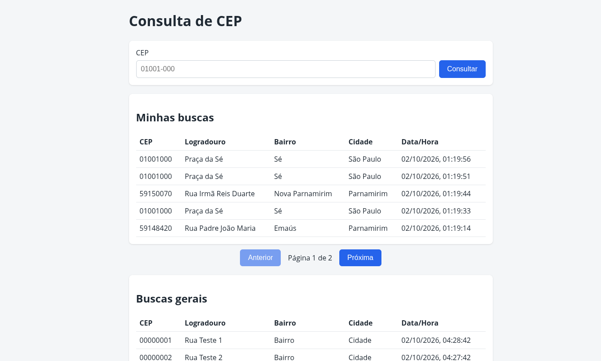

# Consulta de CEP

Aplicação que consulta endereços pela API pública [ViaCEP](https://viacep.com.br) e mantém o histórico das consultas em banco de dados. Desenvolvida como desafio técnico para a vaga de Desenvolvedor Júnior.



## Funcionalidades

- Consulta de endereço por CEP (aceita `01001000` ou `01001-000`)
- Persistência de cada consulta bem-sucedida (ID, CEP, logradouro, bairro, cidade e data/hora)
- Histórico paginado, do mais recente para o mais antigo
- Interface web em React para consultar e ver o histórico
- Tratamento de erros: CEP inválido, inexistente, ViaCEP fora do ar ou lento
- "Minhas buscas": cada visitante vê apenas as próprias consultas, com paginação, via cookie anônimo (só com consentimento)
- Buscas gerais com scroll infinito
- Banner de consentimento de cookies (aceitar, recusar e revogar)

## Tecnologias

| Camada | Tecnologia |
|---|---|
| Backend | Python 3 + FastAPI |
| Banco de dados | SQLite (via SQLAlchemy) |
| Frontend | React (Vite) |
| Testes | pytest |

## Como executar

### Pré-requisitos

- Python 3.9+
- Node.js 20.19+ ou 22.12+ (apenas para gerar a interface)

### Instalação

```bash
git clone https://github.com/Joserafaelnb/consulta-cep.git
cd consulta-cep

python3 -m venv .venv
source .venv/bin/activate        # Windows: .venv\Scripts\activate
pip install -r requirements.txt

cd frontend
npm install
npm run build
cd ..
```

### Execução

```bash
uvicorn app.main:app
```

- Interface: http://127.0.0.1:8000
- Documentação interativa da API: http://127.0.0.1:8000/docs

O banco (`consultas.db`) e a tabela são criados automaticamente na primeira execução.

Se você já tinha um `consultas.db` de uma versão anterior, apague-o antes de subir o servidor: o banco ganhou a coluna `visitor_id` e o `create_all` não altera tabelas existentes.

### Modo desenvolvimento

Em dois terminais:

```bash
# Terminal 1 (raiz, com o venv ativo)
uvicorn app.main:app --reload

# Terminal 2
cd frontend
npm run dev
```

Interface em http://localhost:5173 (o Vite repassa `/api` para o FastAPI).

### Testes

```bash
pytest -v
```

São 27 testes. Eles não acessam a internet nem o banco real: o ViaCEP é simulado e cada teste usa um SQLite em memória. Um aviso de depreciação do Starlette/httpx pode aparecer; ele afeta apenas os testes.

## API

### `POST /api/consultas`

```bash
curl -X POST http://127.0.0.1:8000/api/consultas \
  -H "Content-Type: application/json" \
  -d '{"cep": "01001000"}'
```

```json
{
  "cep": "01001000",
  "logradouro": "Praça da Sé",
  "bairro": "Sé",
  "cidade": "São Paulo",
  "dataConsulta": "2026-10-01T14:32:10.123456"
}
```

O cookie `visitor_id` só é criado se a requisição trouxer o header `X-Cookie-Consent: aceito` (enviado pela interface após o usuário aceitar o banner). Sem o header, a consulta funciona normalmente, mas não fica associada a ninguém.

| Status | Situação |
|---|---|
| 200 | Consulta realizada |
| 404 | CEP não encontrado |
| 422 | CEP com formato inválido |
| 429 | Limite excedido (10 por minuto por IP) |
| 502 | ViaCEP indisponível ou resposta inválida |
| 504 | ViaCEP demorou mais de 5 segundos |
| 500 | Falha ao gravar no banco |

### `GET /api/consultas`

Lista o histórico (mais recente primeiro). Parâmetros opcionais: `limite` (1 a 200, padrão 50) e `offset` (padrão 0). Cada item inclui também o `id`.

```bash
curl "http://127.0.0.1:8000/api/consultas?limite=10&offset=0"
```

### `GET /api/consultas/minhas`

Lista as consultas do visitante identificado pelo cookie `visitor_id`, com paginação por página. Parâmetros opcionais: `pagina` (padrão 1) e `tamanho` (1 a 50, padrão 5). Sem cookie, devolve uma página vazia.

```json
{
  "itens": [],
  "total": 0,
  "pagina": 1,
  "tamanho": 5
}
```

### `DELETE /api/consultas/cookie`

Revoga o consentimento removendo o cookie `visitor_id` (resposta `204`).

## Estrutura do projeto

```
├── app/
│   ├── main.py            # app, middlewares e serviço do frontend
│   ├── routes.py          # endpoints (camada HTTP)
│   ├── schemas.py         # contratos e validação (Pydantic)
│   ├── services/viacep.py # integração com o ViaCEP e suas exceções
│   ├── repository.py      # acesso ao banco
│   ├── models.py          # tabelas (SQLAlchemy)
│   ├── database.py        # engine e sessão
│   ├── limiter.py         # rate limiting
│   └── logging_config.py  # logs
├── frontend/              # aplicação React
├── tests/                 # testes automatizados
├── IA_USAGE.md            # como usei IA neste projeto
└── requirements.txt
```

## Decisões técnicas

- **FastAPI:** validação automática com Pydantic, documentação em `/docs` e suporte a `async` para a chamada externa.
- **SQLite:** não exige servidor. Com o SQLAlchemy, migrar para PostgreSQL exige trocar apenas a `DATABASE_URL`.
- **Camadas (rotas, serviço, repositório):** separam responsabilidades e permitiram simular o ViaCEP e o banco nos testes.
- **Exceções próprias no serviço:** o serviço não conhece HTTP e a rota não conhece `httpx`.
- **`localidade` → `cidade` e `dataConsulta`:** seguem o formato proposto no teste; no Python o campo é `data_consulta`, convertido por alias do Pydantic.
- **Só consultas bem-sucedidas são gravadas:** erros não poluem o histórico.
- **Timeout de 5 s:** evita que a lentidão do ViaCEP trave a API.
- **Paginação:** evita devolver milhares de registros de uma vez.
- **Prefixo `/api` e proxy do Vite:** separam API e interface e evitam CORS em desenvolvimento. Em produção o FastAPI serve o build do React (um único processo).
- **Cookie anônimo com consentimento:** cada visitante recebe um UUID aleatório, sem login e sem dado pessoal. O servidor só cria o cookie quando o usuário aceita o banner; recusar não impede de consultar.
- **Duas paginações diferentes:** "Minhas buscas" usa número de página com total (botões Anterior e Próxima); as buscas gerais usam `limite`/`offset` com scroll infinito (`IntersectionObserver`), reaproveitando a rota que já existia.
- **`visitor_id` fora das respostas da API:** o histórico geral não expõe quem fez cada busca.

## Segurança

Implementado:

- **SQL injection:** consultas parametrizadas (SQLAlchemy) e validação estrita de entrada.
- **Validação por lista de permitidos:** o CEP só é aceito se casar com `[0-9]{5}-?[0-9]{3}` (dígitos ASCII).
- **XSS:** o React escapa o conteúdo por padrão (sem `dangerouslySetInnerHTML`), mais `Content-Security-Policy`.
- **Rate limiting:** 10 consultas por minuto por IP, o que também protege o ViaCEP.
- **Headers de segurança:** `X-Content-Type-Options`, `X-Frame-Options`, `Referrer-Policy` e CSP.
- **Sem vazamento de detalhes:** o cliente recebe mensagens genéricas; o detalhe técnico fica nos logs.
- **Cookie de visitante:** `HttpOnly` (inacessível ao JavaScript), `SameSite=Lax` e valor validado como UUID no servidor. Em produção, com HTTPS, deve-se ativar também o atributo `Secure`.
- **Consentimento e privacidade:** identificação só mediante aceite explícito, com opção de revogar. Descartei o *fingerprinting* por identificar o usuário sem consentimento (LGPD).

Fora do escopo (o que seria feito em produção): proteção contra DDoS volumétrico (CDN/WAF), HTTPS via proxy reverso, autenticação, rate limit distribuído (Redis), migrações (Alembic), SQLAlchemy assíncrono e cache de CEPs.

## Próximos Passos

### CI/CD, Containerização e DevOps
- **Docker & Docker Compose**: Containerização do backend (FastAPI) e frontend (React) com orquestração em ambiente isolado.
- **GitHub Actions**: Pipeline para executar testes automatizados (`pytest`) e build dos containers a cada Pull Request.
- **Refatoração de Arquitetura**: Modularizar arquivos e componentes extensos em submódulos menores.

### Web APIs e Recursos do Navegador
- **Detecção de Tema**: Identificar automaticamente o tema claro/escuro via `prefers-color-scheme`.
- **PWA & Service Workers**: Suporte offline, cache inteligente e opção de instalação como app.
- **Geolocation API**: Preenchimento automático do endereço via localização atual (GPS).
- **Clipboard API**: Botão para copiar o endereço completo formatado com um clique.
- **Speech Recognition API**: Consulta de CEP por comando de voz.
- **Web Share API**: Compartilhamento do endereço diretamente no WhatsApp, Telegram e apps nativos.
- **Drag and Drop API**: Importação de arquivos `.csv`/`.txt` para consultas de CEP em lote.

### Funcionalidades e Regras de Negócio
- **Exclusão de Histórico**: Endpoint e interface para deletar consultas, restrito ao próprio usuário que realizou a busca.

### Acessibilidade (a11y)
- **Modo Baixa Visão**: Ajustes de contraste e dimensionamento de fontes.
- **Suporte a Leitores de Tela**: Revisão semântica (ARIA e roles) para garantir navegabilidade por pessoas cegas.

## Uso de IA

O detalhamento (ferramentas, prompts, validações, o que foi aproveitado, descartado e ajustado manualmente) está em [IA_USAGE.md](IA_USAGE.md).

## Autor

José Rafael · [GitHub](https://github.com/Joserafaelnb)